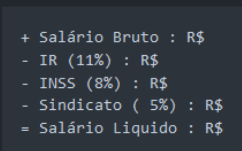

# FAP 2024.1

## Lista de Exercícios I – Introdução a programação com Ruby

### 1. Faça um programa que receba a altura e largura de um retângulo e calcule a área.

[area_retangulo](../Lista01/1area_retangulo.rb)

### 2. Faça um programa que receba dois números do usuário e guarde nas variáveis A e B. Em seguida, calcule a soma, a subtração, a multiplicação e divisão de A por B. Imprima cada um dos resultados.
[quatro_operações](../Lista01/2quatro_operações.rb) | [quatro_operações com função](../Lista01/2quatro_operações_func.rb)

### 3. Escreva um programa que recebe o raio de um círculo como entrada, calcula sua área e exibe o resultado. Dado: área de um círculo = πr², onde r é o raio do círculo. 
   - [Dica: para obter r², simplesmente calcule r\*r.] 
   - [Dica: considere π(pi) igual a 3,14]

[area_circulo](../Lista01/3area_circulo.rb)

### 4. Faça um Programa que peça a temperatura em graus Farenheit, transforme e mostre a temperatura em graus Celsius. C = (5 * (F-32) / 9). 
[fahrenheit_celsius](../Lista01/4fahrenheit_celsius.rb)

### 5. Escreva um programa que leia três valores inteiros que serão armazenados nas variáveis x, y e z. Então, o programa calcula e exibe a soma e o produto desses valores.
[soma_produto](../Lista01/5soma_produto.rb)

### 6. Faça um programa que calcule a tabuada. Receba um valor do usuário e imprima a tabuada deste número.

[tabuada](../Lista01/6tabuada.rb) | 
[tabuada com for](../Lista01/6tabuada_for.rb)

### 7. Escreva um programa que recebe como entrada um número de três dígitos, separa o número em seus dígitos individuais e imprime os dígitos separados um dos outros por um. 
   - (Sugestão: use os operadores de divisão e módulo).

   Por exemplo, se o usuário digitar 349 o programa deve imprimir:
```
3  4  9
```
[digitos_separados](../Lista01/7digitos_separados.rb) | [digitos_separados com string](../Lista01/7digitos_separados_string.rb)


### 8. Faça um Programa que pergunte quanto você ganha por hora e o número de horas trabalhadas no mês. Calcule e mostre o total do seu salário no referido mês.
[calculo_salario](../Lista01/8calculo_salario.rb)


### 9. Calcule e mostre o total do seu salário no referido mês, sabendo-se que são descontados 11% para o Imposto de Renda, 8% para o INSS e 5% para o sindicato. Faça um programa que nos dê:
- Salário bruto.
- Quanto pagou ao INSS.
- Quanto pagou ao sindicato.
- O salário líquido.





Calcule os descontos e o salário líquido, conforme a tabela.

**Obs.:** Salário Bruto - Descontos = Salário Líquido.

[calculo_salario_taxas](../Lista01/9calculo_salario_taxas.rb)